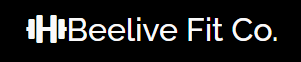

# Beelive Fit Co.

The final site can be viewed at  - [Beelive Fit Co. Live Website]()

&nbsp;

## Information about Beelive Fit Co.

Beelive Fit Co is a simple website would allow them to provide more info to the local community and be a stepping stone to eventually having an online programming.

&nbsp;

## 1. Purpose 

This website was designed and created to fulfill the requirements of the Milestone 1 project for the Diploma in Full Stack Development from Code Institute. In order to build this project HTML, CSS and other skills learnt from the User Centric Design module were used. 

## 2. Aim 

The aim of this project is to create a fully responsive and aesthetically pleasing mobile first design for a personal trainer business. A well designed site would help ‘Beelive Fit Co.’ reach a wider audience and give them a chance to find more business online. The site should provide information and answers to potential new clients and existing ones. Give people the opportunity to know more about what they do and why they should support them. Lastly, the user could find ways to contact and follow Beelive Fit Co.

&nbsp;

# 3. User Experience (UX)

&nbsp;

## 3.1 User Stories

### 3.1.1 First time user of the site goals

- As a first time user, I want to learn a bit more about the business and what they do?
 

- As a first time user, I want to learn where the business is located and what are the opening hours

- As a first time user, I want to navigate the content and be able to interpret and understand the information easily.

- As a first time user, I want to follow the business on social media and be able to contact them. 

- As a first time user, I want to be able to check the site on mobile as well as desktop. 

### 3.1.2 Returning user of the site’s goals

- As a returning user, I want to learn more about feedback options.

- As a returning user, I would like to contact the business to get answers to my questions. 

- As a returning user, I would like to be able to find a phone number to call the personal trainer to ask them for some special classes. 

### 3.1.3 A frequent user of the site’s goals

- As a frequent user, I want to be able to sign up to the Beelive list.

- As a frequent user, I want to be able to find quick links to the personal trainer’s social media pages. 

- As a frequent user, I want to be able to check the latest information about the Covid.

&nbsp;

## 3.2 Personas

Based on the user stories two personas were developed. Personas will give a face and personality to help in the design process. They are useful to refer back to keep a potential user front and centre in all development decisions.

### 3.2.1 Persona 1

### Shannon

&nbsp;

## 3.3 UX Strategy 

The aim of this project is to raise awareness of the stakeholders business with a fully responsive and visually appealing site. The site should be easy to use and build on existing mental models of mobile first design. The business will have a wide demographic so the key information should be easy to find and accessibility will be very important. 

The primary objectives of the site would be 

- Give users the chance to learn more about the business
- Show customers what is unique about Beelive Fit Co. through text and visuals. 
- Be able to communicate what services the business offers in changing covid 19 requirements.

Meeting the user’s needs and goals

- The site should be fully responsive and have the same effectiveness on mobile and desktop.
- Imagery and icons used with short bursts of text. This will inform the user but not overwhelm and can give them the chance to learn more if they so wish.
- A single page scrolling site that will guide the user to the relevant section without confusing them by moving away from the core home page. 
- Fixed header to aid with the user’s navigation on the site for ease of use. 
- Clear indicators of social media links, contact number and google map locations if the user wishes to find the stakeholder or find out more about the business.

Following current industry best practices the site will be a one page scrolling site on desktop, with the navigation bar collapsing into a hamburger menu with a pop up modal on mobile and tablet. 

## 3.4 Scope

Using Lean UX a minimum viable product (MVP) was developed in order to learn quickly about what will work on the site. Developing the site in this way will allow time for testing and give ample opportunity to fix any bugs or features that may not be working. Using a Lean UX methodology will enable us to see if we 

- Can clearly communicate what the business is about and what services we offer to the local community. 
- Provide a way for users to connect or contact the business.
- Give returning user’s the chance to learn more about what class is on this week.
- Help new user’s locate us so they can visit us in the store
- Provide an overall positive experience across all devices that a new user may use. 
- That the site is built using correct HTML semantics and follows industry standards for accessibility. 

## 3.5 Structure

The website will operate as a scrolling one page site on desktop, with the navigation changing to a hamburger menu on mobile. The website will be broken into four sections that will help first time, frequent and returning users get answers to their questions. The navigation will be sticky and be viewable at each section of the site.

- About Us section
    - This section will clearly outline what Beelive fit is, what classes does the personal trainer offer and why you might choose Beelive Fit Co. over other Personal Trainers.

- Feedback section
    - This will provide some imagery to the user that will give them a feedback from some customers already using the business.

- Location section
    - This will provide the user with all of the information to help locate and visit the coach. There will be a map link to google maps as well as the address and contact number.

- Contact Us section
    - This section will help the user send a quick question or query to the business without leaving the site. This will present a good opportunity for the user to feel the have a direct line of communication with the business.

### 3.5.1 Information Architecture for the site

## 3.6 Skeleton

The wireframes were designed and built in [Balsamiq](https://balsamiq.com/) . They can be viewed at the following.

- [Desktop]()

- [Ipad]()

- [Mobile]()

&nbsp;

## 3.7 Surface

### 3.7.1 Colour

As the website is for a local personal trainer service the colours and style should reflect that in the design. In order to get an idea of some colours I took a look at some photos from google about bees and honeycomb.

&nbsp;

Colors: rgba(255, 162, 0, 1) Orange

&nbsp;

        #555555 Grey

&nbsp;

        rgba(0, 0, 0, 0.5) Black

### 3.7.2 Typography

- For the headings on the site I have chosen [Raleway by Google Fonts](https://fonts.google.com/specimen/Raleway). I decided to use this font as a wide demographic would be using this site. Raleway is clear and fits well with the brand aesthetic. It also is likely that a user may not have trouble with this font as most devices will support google fonts.

&nbsp;

&nbsp;

- For the body text on the site I used [Roboto by Christian Robertson](https://fonts.google.com/specimen/Roboto). Roboto is described as a font that allows for a more natural reading rhythm, which is will help the user navigate the content. Roboto is seen very often on websites and this in term will aid the user by building on existing mental models.

&nbsp;

&nbsp;

# 4. Features 

## 4.1 Existing Features
- Website designed with HTML5, CSS3 and Bootstrap.
- A modern single page site that scrolls to each section.
- A fixed navigation bar that will keep the user informed where they are on the page and will also user hover fuctions to prompts possible page destination.
- Fully responsive one page site that will adapt for desktop, tablet and mobile view. This will not comprimise the user experience as each layout is designed with screen size in mind.
- Contact form for quick communication with the business.
- Quick links in the footer to all available social media for Beelive Fit Co.

## 4.2 Future Features 

- Testimonals or clients feedback. Possibly display the google reviews and updates as more become available.
- A about us section explaining the business.
- A working contact form when I learn more about Javascript and the backend requirements for this. 

&nbsp;

## 5.2 Frameworks, Libraries, Programs and Sites.

- [Bootstrap](https://getbootstrap.com/) - Bootstrap was used to take advantage of the grid, ease of use for responsive layout and components like navbar, cards, existing CDN CI template and footer.

- [Balsamiq](https://balsamiq.com/) - Balsamiq was used to create wireframes for mobile, tablet and desktop.

- [Adobe XD](https://www.adobe.com/ie/products/xd.html) - Adobe XD was used to create graphics, logo and personas that are included in the readme

- [Adobe Illustrator](https://www.adobe.com/products/illustrator.html) - Illustrator was used to change colour of SVG icons to use in the README logo for Beelivefit Co.

- [Google Fonts](https://fonts.google.com/) - The fonts 'Raleway' and 'Roboto' were found and the relevant CSS styling was taken from this site to import the fonts for use.

- [Typewolf](https://www.typewolf.com/) - Typewolf was used to help get an insight into popular font pairings and for seeing what may work from google fonts selections. 

- [Font Awesome](https://fontawesome.com/) - Font awesome provided the icons and code for the icons used in the about us section, and footer.

- [Favicon](https://www.favicon-generator.org/) - Favicon generaton provided my icon beside the Title.

## 5.3 Workspace, Repositories and Version Control

- [Github](https://www.github.com) - This project and all its files are hosted on github and the live website is hosted by using Git Hub Pages.

- [Gitpod](https://www.gitpod.io) - Gitpod is recommended by the coding institute and was used as the IDE. It also enabled me to add, commit and push to GitHub and keep track of version control. 

&nbsp;

# 6. Testing 

- Testing results can be read in the [testing.md]() file.

&nbsp;

# 7. Deployment 

&nbsp;

## 7.1 Publishing

Beelive Fit Co. site was published using [GitHubPages](https://pages.github.com/). In order to do this I took the following steps.